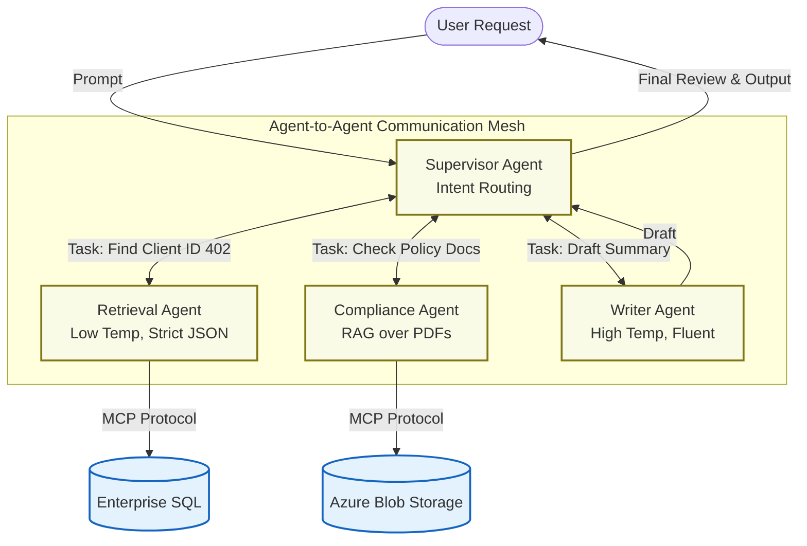

# Agent-to-Agent (A2A) & Multi-Agent Orchestration

## 1. Core Concept

In a standard RAG architecture, you typically have a single, monolithic large language model (often managed by an orchestration layer like Semantic Kernel) trying to do everything: understand the prompt, execute the retrieval, format the data, and generate the final response.

**A2A shifts the paradigm from a single monolithic application to a distributed micro-workforce.**

A2A protocols define the standardized communication schemas (message formats, handshakes, state transfers) that allow independent, specialized AI agents to collaborate. Instead of one massive prompt, you could have a "Router" agent that delegates tasks to  a "Retrieval" agent, which then passes data to an "Analyst" agent.

### Why It Matters for Enterprise Architecture

- **Separation of Concerns:** A model optimized for strict, literal SQL generation (Retrieval Agent) doesn't need the massive parameter count or creative temperature of a model designed for drafting client summaries (Synthesis Agent).
- **Reduced Hallucinations:** Smaller, highly constrained agents with single responsibilities are much easier to ground and test.
- **Fault Tolerance:** If a retrieval agent fails to find a record, it can send an error code back to the orchestrator rather than making up a response.

## 2. Architectural Flow

A standard A2A pattern often utilizes a **Supervisor (or Orchestrator) Pattern**, where a primary agent delegates sub-tasks and manages the final output.

_Note: In modern architectures, specialized agents often use MCP to actually touch the data._




## 3. Implementation Patterns (Python / Semantic Kernel)

While protocols like Google A2A are emerging to standardize cross-platform agent chat, frameworks like Microsoft AutoGen or the experimental multi-agent features in Semantic Kernel are currently driving enterprise implementations.

Here is a conceptual look at how you define agents and their communication protocols in a modern Python framework:

```python
# Conceptual Multi-Agent Setup (e.g., AutoGen / SK Multi-Agent)
from enterprise_agent_framework import Agent, GroupChat, GroupChatManager

# 1. Define the highly specialized Retrieval Agent
# This agent has NO ability to write emails; it only runs data queries.
retrieval_agent = Agent(
    name="Data_Specialist",
    system_message="You are a strict data retrieval agent. Use your attached tools to fetch exact records. Output ONLY raw JSON. Never converse.",
    llm_config={"model": "gpt-4o-mini", "temperature": 0.0}
    # This agent would have an MCP Tool attached to it here
)

# 2. Define the Compliance/Writer Agent
advocacy_agent = Agent(
    name="Advocate_Summarizer",
    system_message="You draft secure updates regarding clients. You must strictly adhere to HIPAA guidelines and never expose raw identifiers. Use the JSON provided by the Data Specialist.",
    llm_config={"model": "gpt-4o", "temperature": 0.4}
)

# 3. Establish the A2A Protocol (The Group Chat / State Manager)
# This dictates HOW they talk. Does the advocate talk directly to the data specialist, 
# or does it go through a router?
a2a_network = GroupChat(
    agents=[retrieval_agent, advocacy_agent],
    messages=[],
    max_round=5, # Crucial: Prevent infinite loops between agents
    speaker_selection_method="auto" # The LLM decides who speaks next based on the task
)

# 4. The Orchestrator manages the actual execution
manager = GroupChatManager(groupchat=a2a_network)

# Trigger the A2A workflow
manager.initiate_chat(
    message="Get the latest care plan for the client with ID 402 and draft a secure status update."
)
```

## 4. Cloud Deployment (Azure Architecture)

Deploying a multi-agent system requires managing state and compute efficiently, leveraging your fundamental Azure knowledge.

- **Compute:** Deploying agents as microservices using Azure Container Apps (ACA) is ideal. Because agents might sit idle waiting for a specific sub-task, ACA's scale-to-zero capability prevents you from paying for idle compute.
- **State Management:** Agents need a shared scratchpad (the context window). In a stateless MaaS deployment, you must back the A2A communication log with a fast, scalable database (like Azure Cosmos DB or Redis) so agents can quickly read the history of the current task without dropping data.
- **Networking:** All agent-to-agent communication should occur over internal VNets. Agents should never expose their individual APIs to the public internet; only the Orchestrator/Supervisor should have an ingress endpoint.

## 5. Enterprise Governance & NIST AI RMF

When working within state government or handling sensitive data, deploying multi-agent systems introduces unique governance challenges that frameworks like NIST aim to control.

- **Traceability (The "Black Box" Problem):** When three AI agents talk to each other to solve a problem, how do you audit their logic? You must implement strict tracing (e.g., Azure Application Insights) that logs the exact prompt, response, and tool execution of _every individual agent_ during a transaction.
- **Loop Mitigation:** Agents can get stuck in "hallucination loops" (Agent A asks Agent B for data, Agent B hallucinates an error, Agent A re-asks indefinitely). Always implement hard circuit breakers (like `max_round` in the code above) and timeout thresholds.
- **Data Boundaries:** Enforce strict separation. The agent drafting the final output should have its context window scrubbed of sensitive identifiers before generation, ensuring client data remains secure and adheres to established compliance standards.


## A2A Standardization

- A2A (Agent-to-Agent) is primarily an **architectural design pattern**, but the industry is actively developing strict A2A protocols to standardize how that pattern is executed.

### 1. A2A as an Architectural Pattern

At its core, A2A is a **system design pattern** within the broader field of Multi-Agent Systems (MAS).

If you think about traditional software development, moving to an A2A architecture is exactly like moving from a monolithic application to **microservices**:

- Instead of one giant, stateful block of code (or one massive LLM prompt) trying to handle retrieval, logic, and formatting, you decouple those responsibilities.
- You create discrete, single-purpose agents that operate independently and pass data to one another to achieve a broader goal.

### 2. A2A as a Protocol

While the _pattern_ is microservices for AI, a **protocol** is the actual set of rules those agents use to communicate.

Just like microservices need REST, gRPC, or AMQP to understand each other across a network, independent AI agents need a standardized language to pass context. If an Azure-hosted Semantic Kernel agent needs to ask a Google Gemini agent for a summary, they can't just throw raw text at each other. They need an A2A Protocol.

An A2A protocol defines:

- **Message Schemas:** The exact JSON structure for asking a question, passing state, or returning a result.
- **Handshakes:** How Agent A verifies that Agent B exists and understands the request.
- **State Transfer:** How the history of the task is packaged and passed down the line.
- **Error Handling:** Standardized codes for when an agent fails (e.g., "Tool Execution Failed" vs. "Context Window Exceeded").

### The Current Landscape (as of 04/2026)

The reason the terminology feels muddy is that we are in a transitional phase:

- **Framework-Specific "Protocols":** Right now, most A2A communication happens _within_ a specific framework. If you build three agents in Microsoft AutoGen or Semantic Kernel, those frameworks handle the routing and message schemas internally. They have their own proprietary ways of making agents talk.
- **True Universal Protocols (The Future):** This is where initiatives like **Google A2A** (mentioned in your job description) come in. The goal is to build an open, agnostic standard (just like HTTP or MCP) so that an agent built in Python on AWS can seamlessly collaborate with an agent built in C# on Azure, regardless of the underlying LLM.