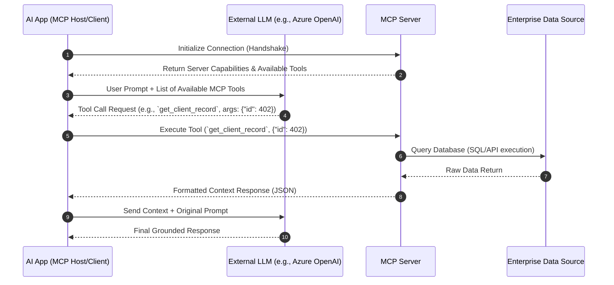
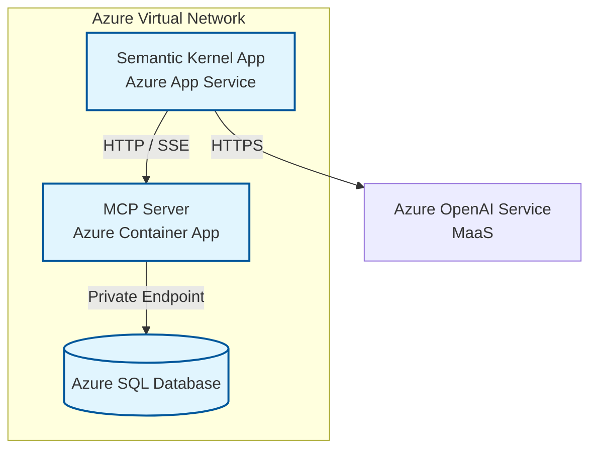

# Model Context Protocol (MCP) Architecture & Implementation

## 1. Core Concept

The Model Context Protocol (MCP) is an open standard designed to create a universal, standardized bridge between AI models and data sources. Instead of writing custom API integration code (plumbing) for every new database, internal tool, or file system your AI needs to access, you deploy a standardized **MCP Server** alongside that data.

Think of it as a "USB-C for AI." It preserves a stateless architecture: the LLM requests data via a standard protocol, the MCP server executes the local retrieval, and passes the context back.

### Why It Matters for Enterprise RAG

- **Standardization:** Replaces custom API routing with a universal JSON-RPC protocol.
- **Security & Governance:** Data never moves to the LLM provider. The lightweight server lives _with_ the data (behind enterprise firewalls), executing queries and returning only the exact context required for the prompt.
- **Separation of Concerns:** Decouples the orchestration logic (Semantic Kernel) from the data retrieval mechanics.

## 2. Architectural Flow

MCP operates on a strict Client-Server architecture over two primary transport layers:

1. **`stdio` (Standard Input/Output):** Ideal for local development, CLI environments, and local-first applications. The client spins up the server as a subprocess.
2. **SSE (Server-Sent Events) over HTTP:** Ideal for remote deployments (like Azure) where the MCP server runs as an independent microservice.



## 3. Python Implementation (Local `stdio` Server)

Here is an example of building a fast, local MCP Server using Python. This server exposes a tool that queries a local SQLite database, maintaining that secure, local-first data retrieval philosophy.


```python
# pip install mcp
import sqlite3
from mcp.server.fastmcp import FastMCP

# Initialize the MCP Server
# Dependencies are automatically handled by FastMCP
mcp = FastMCP("EnterpriseDataServer")

# Create a local connection to your mock database
def query_database(query: str, parameters: tuple = ()) -> list:
    conn = sqlite3.connect("enterprise_data.db")
    cursor = conn.cursor()
    cursor.execute(query, parameters)
    results = cursor.fetchall()
    conn.close()
    return results

# The @mcp.tool decorator automatically registers this function 
# as an available capability to the connecting MCP Client.
@mcp.tool()
def get_client_record(client_id: int) -> str:
    """
    Retrieves secure client metadata from the local database.
    This description is sent to the LLM so it knows WHEN to use this tool.
    """
    try:
        # Execute local, isolated query
        result = query_database(
            "SELECT name, status, risk_level FROM clients WHERE id = ?", 
            (client_id,)
        )
        
        if not result:
            return f"No client found with ID: {client_id}"
            
        # Format and return the specific context needed for grounding
        client = result[0]
        return f"Client Name: {client[0]}, Status: {client[1]}, Risk Level: {client[2]}"
        
    except Exception as e:
        return f"Database error occurred: {str(e)}"

if __name__ == "__main__":
    # Runs the server over stdio for CLI/local app consumption
    mcp.run()
```

## 4. Cloud Deployment (Azure Architecture)

When moving from local prototyping to an enterprise environment, you transition from `stdio` to HTTP/SSE transports.



**Deployment Strategy:**

1. **Containerization:** Package the Python MCP Server (using a framework like FastAPI or Starlette for the SSE transport) into a Docker container.
2. **Azure Container Apps (ACA):** Deploy the container to ACA. This provides scalable, serverless microservices that can scale to zero when no tools are being called.
3. **VNet Integration:** Ensure the MCP Server is injected into a secure VNet so it can communicate securely with backend databases (Azure SQL) via Private Endpoints.
4. **The Client:** Your Semantic Kernel orchestration app acts as the MCP Client, communicating with the Container App over HTTP/SSE.

## 5. Industry Best Practices & Security

- **Implement "Least Privilege" at the Server Level:** The MCP server should connect to databases using a managed identity or service principal that only has `READ` access to the specific tables required for RAG context.
- **Audit Logging for Governance:** Complying with NIST frameworks requires observability. Log every tool execution _inside_ the MCP server (Input parameters, user ID, timestamp) before executing the database query. This ensures a verifiable trail of what data was accessed for AI generation.
- **Prompt Injection Mitigation:** Treat all parameters passed from the LLM to the MCP tool as untrusted user input. Always use parameterized queries (as shown in the Python example) to prevent SQL injection via the AI model.
- **Stateless Execution:** Ensure the MCP server holds no conversational memory. It should simply receive a request, fetch the data, and return it. The orchestration layer (Semantic Kernel) manages the conversation state.

## 6. Tips & Tricks

- **The MCP Inspector:** When developing locally, use the official MCP Inspector utility (`npx @modelcontextprotocol/inspector`). It provides a GUI to connect to your local `stdio` server, inspect available tools, and test inputs/outputs without needing to spin up a full LLM client.
- **Focus on the Docstrings:** The `@mcp.tool()` relies heavily on Python docstrings. The LLM decides which tool to use based _entirely_ on the text you write in the docstring. Be highly descriptive about what the tool does and what parameters it requires.
- **Don't Rebuild the Wheel:** There is a rapidly growing ecosystem of open-source MCP servers (e.g., for GitHub, PostgreSQL, Google Drive). Evaluate existing community servers for enterprise fit before writing custom ones.