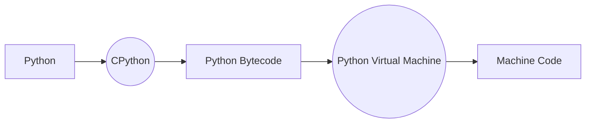
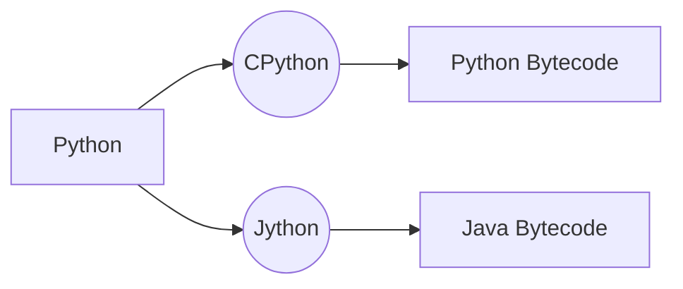

- While the theoretical behavior of Python code across different implementations is the same, it may vary in practice.

# Implementations

* **CPython**: The `default` Python implementation. First to get latest language features.
* **Jython**: A `Java` implementation that can use Java packages and compiles to Java bytecode.
* **IronPython**: Written in `C#`. Can use `.NET` packages and libraries.
* **PyPy**: Written in a `subset of Python`.

## Execution Flow Diagrams

### Standard CPython Execution

### CPython vs. Jython Bytecode Compilation

