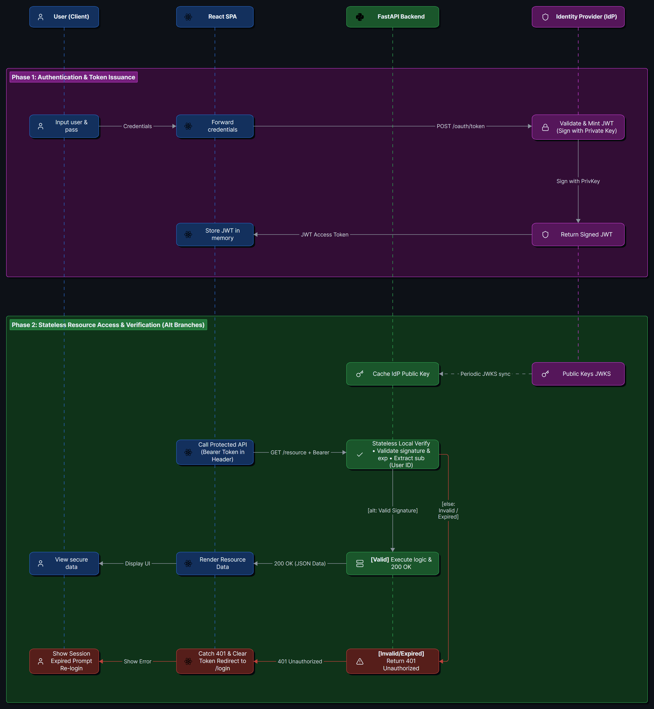

> A **JSON Web Token (JWT)** is a compact, self-contained standard for securely transmitting information between parties as a JSON object. This information can be verified and trusted because it is digitally signed.

## 1. Core Concept

- **Stateless Verification:** Unlike traditional opaque tokens (which require the server to query a database to check if the token is valid), a JWT contains all the necessary data within itself. The server only needs the cryptographic public key to mathematically verify the token's authenticity.
- **Relationship to Protocols & Schemes:**
  - A JWT is strictly a **credential format**.
  - It is most commonly used as the underlying payload in **authentication protocols** like OpenID Connect (OIDC).
  - When transmitted over HTTP, it is almost universally delivered using the `Bearer` **authentication scheme** in the `Authorization` header (`Authorization: Bearer <token>`).
- **Analogy:** Think of a JWT as a **digitally signed driver's license**. The bouncer (your server) doesn't need to call the DMV (the Auth Server) every time you want to enter the club. The bouncer simply inspects the license, reads your birthdate (the payload), and checks the holographic state seal (the signature) to prove it isn't a fake.

### The Anatomy of a JWT

A standard JWT consists of three parts separated by periods (`.`): `Header.Payload.Signature`. Each part is `Base64Url` encoded.

- **Header:** Defines the type of token (usually `JWT`) and the cryptographic algorithm used to sign it (e.g., `HS256` for symmetric or `RS256` for asymmetric).
- **Payload (Claims):** The actual JSON data being transmitted. These pieces of data are called "claims."
  - **Registered Claims:** Standardized fields built into the spec.
    - `sub` (Subject): The unique identifier for the user.
    - `iss` (Issuer): Who created and signed the token (e.g., Okta).
    - `exp` (Expiration Time): The exact timestamp when the token becomes invalid.
    - `aud` (Audience): Who the token is intended for (e.g., your specific API).
  - **Public Claims:** Custom data that is broadly useful but not part of the core spec (e.g., `email`, `role`).
  - **Private Claims:** Highly specific custom data agreed upon between your specific client and server.
- **Signature:** The mathematical proof. It is created by taking the encoded Header, the encoded Payload, and a secret key, then running them through the algorithm specified in the header.

### How Mathematical Verification Works

- When a backend server receives a JWT, it needs to prove the token was genuinely issued by the trusted Identity Provider (IdP) and hasn't been tampered with.
  - It does this entirely statelessly. How this works depends on the cryptographic algorithm used:

#### Asymmetric Cryptography (e.g., `RS256` - The Modern Standard)

- The IdP uses a highly guarded **Private Key** to generate the signature:
  - It does this by first calculating the hash of the `Header` and `Payload`,
  - and then *encrypting* that hash using the Private Key.
- This encrypted hash is the **Signature**. The backend server then uses the IdP's widely available **Public Key** to *verify* it:
  1. The server independently calculates the hash of the incoming `Header` and `Payload`.
  2. The server uses the **Public Key** to "decrypt" the incoming `Signature` (which reveals the original hash the IdP calculated).
  3. The server compares the two hashes. If they match exactly, the token is authentic.

  > `NOTE:` An attacker **cannot** forge a signature. While an attacker can easily alter the payload and calculate a new hash, they do not possess the Private Key required to *encrypt* that new hash into a valid signature. The Public Key can only decrypt; it is mathematically impossible to use it to create a signature.
  >

#### Symmetric Cryptography (e.g., `HS256` - Legacy/Internal)

- Both the IdP and the backend server share a single **Secret Key**.
  1. The server takes the incoming `Header` and `Payload` and re-runs the hashing algorithm using the Shared Secret.
  2. This generates a *new* signature locally.
  3. The server compares its locally generated signature against the token's attached signature. If they match, it's authentic. An attacker without the Shared Secret cannot forge a signature.

### Why It Matters for Serverless Architecture

- **Performance at Scale:** In a decoupled, serverless environment (like GCP Cloud Run), horizontal scaling is critical. If your FastAPI backend had to make a network call to Okta for every single API request to validate a token, it would create a massive bottleneck.
- **Independent Validation:** JWTs allow hundreds of isolated microservices to validate identity completely independently, reading the payload locally in milliseconds.

---

## 2. Architectural Flow Diagram



---

## 3. Python Implementation

This snippet demonstrates how a FastAPI backend might securely decode and verify a JWT using the `PyJWT` library.

```python
# Setup: pip install PyJWT

import jwt
from fastapi import HTTPException, Security, status
from fastapi.security import HTTPBearer

# We use the standard HTTPBearer scheme to extract the token from the header
security = HTTPBearer()

# In production, this public key is fetched dynamically from the Identity Provider's JWKS endpoint
# (e.g., https://your-domain.okta.com/oauth2/default/v1/keys)
MOCK_PUBLIC_KEY = """-----BEGIN PUBLIC KEY-----
MIIBIjAN... (truncated for brevity)
-----END PUBLIC KEY-----"""

def verify_jwt_token(token: str) -> dict:
    """
    Cryptographically verifies the JWT signature and extracts the payload.
    """
    try:
        # jwt.decode automatically verifies the signature AND checks the 'exp' (expiration) claim
        payload = jwt.decode(
            token,
            key=MOCK_PUBLIC_KEY,
            algorithms=["RS256"],
            audience="my_fastapi_backend" # Ensures this token was actually meant for us
        )
        return payload  # prints {'sub': 'user_123', 'role': 'admin', 'exp': 1735689600}
      
    except jwt.ExpiredSignatureError:
        # The token's 'exp' timestamp is in the past
        raise HTTPException(
            status_code=status.HTTP_401_UNAUTHORIZED,
            detail="Token has expired"
        )
    except jwt.InvalidTokenError:
        # The signature didn't match, or the token is malformed
        raise HTTPException(
            status_code=status.HTTP_401_UNAUTHORIZED,
            detail="Invalid token signature"
        )
```

---

## 4. Industry Best Practices & Security

- **JWTs are Encoded, NOT Encrypted:**
  - This is the most common misconception. The `Base64Url` encoding can be easily decoded by anyone (just paste a token into jwt.io).
  - **Rule:** *Never* put sensitive Personally Identifiable Information (PII) like social security numbers, passwords, or internal database secrets inside the payload.
- **Keep Tokens Short-Lived:**
  - Because a JWT is self-contained, it is very difficult to invalidate (revoke) it before it naturally expires. If an attacker steals a JWT, they possess that identity until the `exp` claim passes.
  - **Rule:** Access tokens should have short lifespans (e.g., 5 to 15 minutes). Use a separate, heavily guarded mechanism (like an OIDC Refresh Token) to get new ones.
- **Always Validate the Algorithm (`alg`):**
  - Historically, vulnerabilities existed where attackers changed the header to `alg: none`.
  - **Rule:** Modern libraries handle this well, but always explicitly define `algorithms=["RS256"]` when decoding to force strict cryptographic checks.

---

## 5. Tips & Tricks

- **Debugging:** Bookmark `jwt.io`. It is the easiest way to inspect a token's payload during local development. Just remember never to paste production tokens with real signatures into third-party websites.
- **The "API Key" exception:** While a JWT is a credential, it is entirely different from a standard opaque API key. An API key is just a random string that acts as *both* the credential and the secret, requiring stateful database lookups. A JWT separates the credential (the token) from the secret (the cryptographic key).
