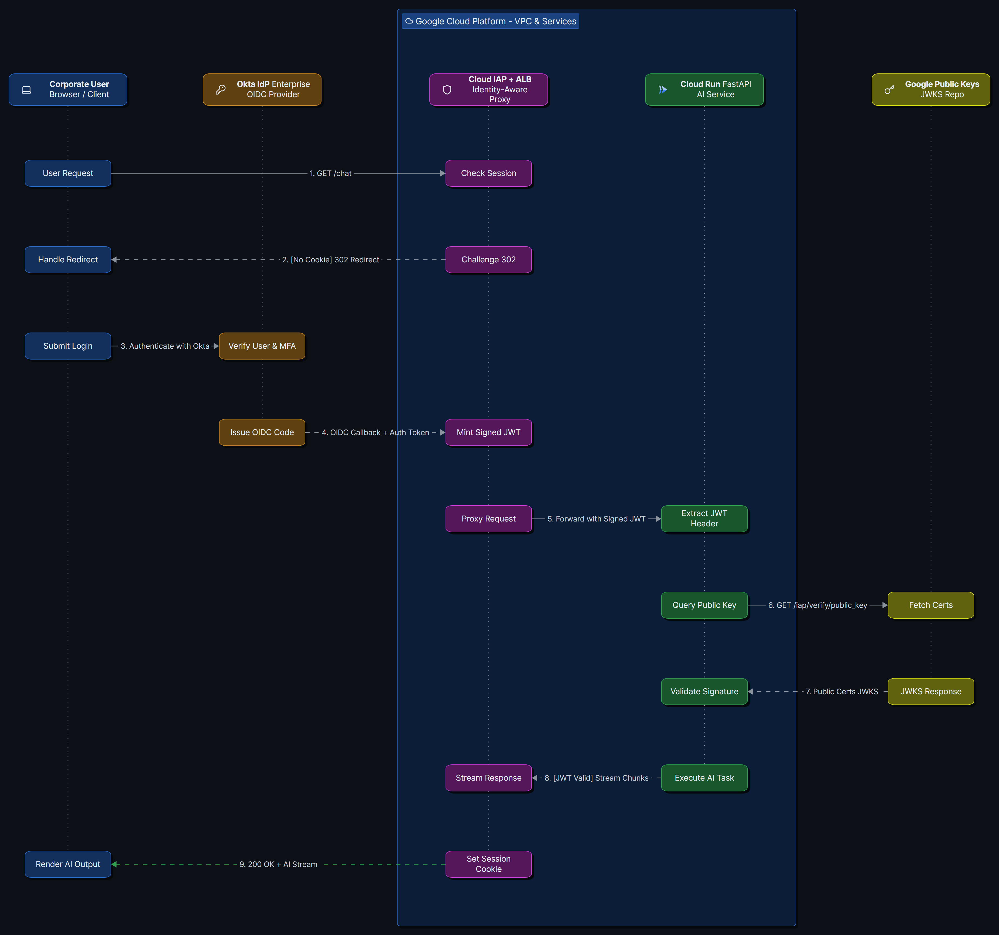

> **GCP Identity-Aware Proxy (IAP)** acts as a Zero Trust security boundary, intercepting traffic at the load balancer level, authenticating the user via an Identity Provider (like Okta), and securely passing that verified identity down to backend services (like Cloud Run) using a cryptographically signed **JSON Web Token (JWT)**.

## 1. Core Concept

- **The IAP JWT Header:** When IAP successfully authenticates a user, it doesn't just blindly forward the raw HTTP request to your application. It injects a special HTTP header called `X-Goog-Authenticated-User-JWT`.
- **Google as the Issuer:** This injected JWT is fundamentally different from a token minted directly by Okta. While Okta verified the user, *Google IAP* mints and signs this specific JWT using Google's own private keys.
- **The Payload:** The payload of this IAP JWT contains the authenticated user's identity (their email or ID) in the `sub` or `email` claims.
- **Zero Trust Perimeter:** Your backend FastAPI application running in Cloud Run should *never* trust that a request is secure just because it came from the internal VPC. It must mathematically verify the signature of the `X-Goog-Authenticated-User-JWT` to prove the request genuinely passed through the IAP security checks.

### Why It Matters for Zero Trust

- **Defense in Depth:** Even if a malicious actor breached the internal corporate network and tried to send a direct HTTP request to the internal Cloud Run URL, they could not bypass security. Because they cannot forge Google's cryptographic signature on the JWT, the FastAPI backend will instantly reject the fake request.
- **Decoupling Auth from Business Logic:** Your backend developers do not need to write complex SAML or OIDC login flows. They only need to write a simple middleware that verifies a standard JWT signature. IAP handles the heavy lifting of the actual login screens and session cookies.

### How IAP and the ALB Actually Interact

It is common to say IAP is "attached" to the load balancer, but in Google Cloud, IAP is natively integrated into the ALB's underlying proxy infrastructure (the Envoy proxies). It is not a separate server sitting in front of the ALB. 

1. **The ALB Handles the Connection:** The ALB receives the raw HTTP request from the corporate network and terminates the SSL/TLS certificate.
2. **The IAP Interception Point:** If IAP is enabled for a specific *Backend Service* (e.g., your FastAPI Cloud Run NEG), the ALB pauses the routing process and hands the request to the local IAP module.
3. **The IAP Policy Evaluation:** IAP checks for the session cookie. If missing, it tells the ALB to immediately return a `302 Redirect` to Okta. If present, it evaluates IAM permissions and mints the JWT.
4. **The Handoff & Final Route:** IAP injects the JWT into the HTTP headers and hands the request *back* to the ALB's routing engine, which forwards it to the Cloud Run container.
- > `NOTE:` Because IAP is applied at the *Backend Service* level, a single shared ALB can route traffic to an unauthenticated public website on one path, while strictly enforcing IAP on another path.

---

## 2. Architectural Flow Diagram

---

## 3. Industry Best Practices & Security

- **Strict Audience Validation:**
	- `Audience` (`aud`) validation is non-negotiable. If you don't check the audience, a valid IAP token from *App A* could be maliciously sent to *App B*, and *App B* would accept it because the Google signature is technically valid.
	- **Rule:** Always ensure the `aud` claim matches the exact GCP Backend Service ID or project number of your specific application.
- **Do Not Trust `X-Goog-Authenticated-User-Email`:**
	- IAP also injects a plaintext header called `X-Goog-Authenticated-User-Email`. 
	- **Rule:** *Never* use this plaintext header for authorization. It can be easily spoofed if the network perimeter is misconfigured. *Always* rely on the cryptographically signed `X-Goog-Authenticated-User-JWT`.

---

## 5. Tips & Tricks

- **Local Development Bypass:** When running your FastAPI app locally, you won't have IAP sitting in front injecting JWTs. You'll need to create a development toggle in your code that bypasses the `verify_iap_jwt` dependency and injects a mock user payload when a local `.env` flag (e.g., `ENV=local`) is set.
